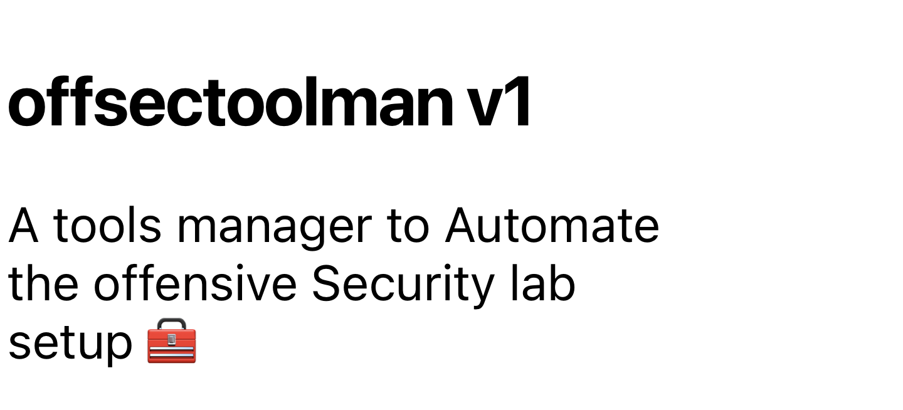
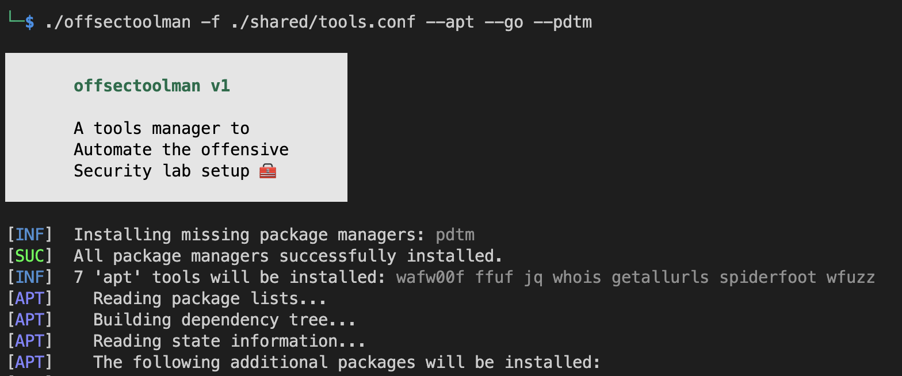

# 

**offsectoolman** is a tool manager designed to automate the setup of an offensive security lab. It allows you to install and manage various package managers and tools commonly used in offensive security tasks. The tool supports installation on Linux systems and provides a simple and efficient way to get your lab up and running quickly.

## Features

- Automates the installation of package managers like apt, npm, go, pdtm, and pip3.
- Installs and manages various tools for offensive security tasks.
- Customizable configuration file to define the tools and their respective package managers.
- Color-coded log messages for better visibility and readability.
- Simple command-line interface for easy interaction.

## Requirements

- Linux-based system
- Bash shell

## Installation

1. Clone the repository:

```bash
git clone https://github.com/yourusername/offsectoolman.git
cd offsectoolman
```

2. Make the script executable:

```bash
chmod +x offsectoolman.sh
```

## Usage

```bash
./offsectoolman.sh [OPTIONS]
```

**Options:**

- `-f, --file FILE`: Specify the configuration FILE (required).
- `--apt`: Install missing 'apt' package manager.
- `--npm`: Install missing 'npm' package manager.
- `--go`: Install missing 'go' package manager.
- `--pdtm`: Install missing 'pdtm' package manager.
- `--pip3`: Install missing 'pip3' package manager.
- `-h, --help`: Show the usage message.

## Configuration File

The configuration file (`offsectoolman.conf`) allows you to define the tools and their respective package managers. The syntax is as follows:

```
[apt]
tool-source:tool-cli
...

[npm]
tool-source:tool-cli
...

[go]
tool-source:tool-cli
...

[pdtm]
tool-source:tool-cli
...

[pip3]
tool-source:tool-cli
...
```

Replace `tool-source` with the name of the tool and `tool-cli` with the corresponding command to install the tool using the specified package manager.

### Default tools source file

If the `-f` option is not provided, the script will use the default configuration file `./shared/tools.conf` located in the same directory as the script. If the default file is not found, the script will print an error message and exit.

## Examples

Install missing 'apt' and 'go' package managers:

```bash
./offsectoolman.sh -f ./shared/tools.conf --apt --go -pdtm 
```

## Screenshots

 

## License

This project is licensed under the [MIT License](LICENSE).

## Acknowledgments

- Thanks to [OpenAI](https://openai.com) for their amazing GPT-3.5 model.

## Contributing

Contributions are welcome! Please create an issue or submit a pull request.

## Disclaimer

Use this tool responsibly and only on systems you own or have permission to test. The authors are not responsible for any misuse or damage caused by this tool.

## Contact

For any questions or inquiries, feel free to contact us at support@example.com.